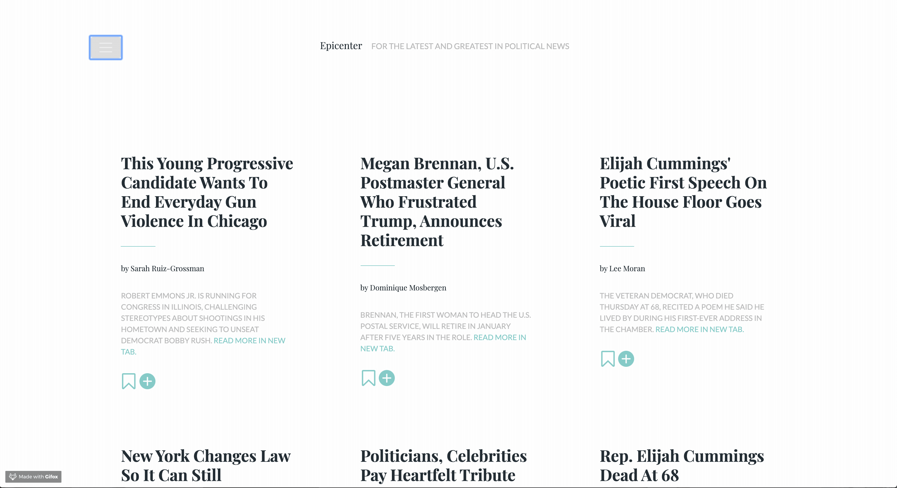

# News Scraper: Epicenter
Your one source for all things political! We give you the headlines and short descriptions to provide our audience with the fastest way to learn what is new and stay infromed. What to learn more about it? We also provide a link to the full article.

### There is always so much change going on in Politics. You need to stay informed!
This app scrapes the HuffPost's Politics page and shows you all their latest articles, just refresh the news!

### On Epicenter you can: 

1. Saved Articles: On the home page, press the bookmark icon to save the article. Head on to "Saved Article" page to see all the articles that were saved.

2. Add comments: click on the "+" icon and head over to the article page to add a comment!

3. Refresh News: Click on "Refresh News" and make sure that you are seeing the most recent news!

See it live: https://epicenter-news.herokuapp.com/

## Technologies Used  
* Mongoose
* Cheerio 
* Bootstrap 4
* Handlebars
* ES6

## Areas for Further Development
* More robust article information, including images, publication dates, etc.
* The ability to see the full article when click in to the article to see the notes
* Added date for when a comment was posted and ability to comment and make threads
* Adding in a "next page" or "load more" feature when there are more than a certain number of articles in the database.
* Users should have to create accounts and sign in to use all the features of the site. This will allow for...
    1. Individual users to have their own individual set of saved articles.
    2. Comments to be visibly associated with a username.
    3. Users to only be able to delete their own notes.

###### Happy Reading!

